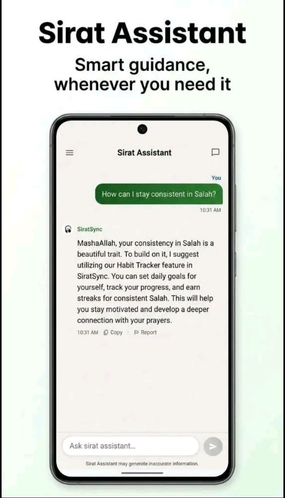
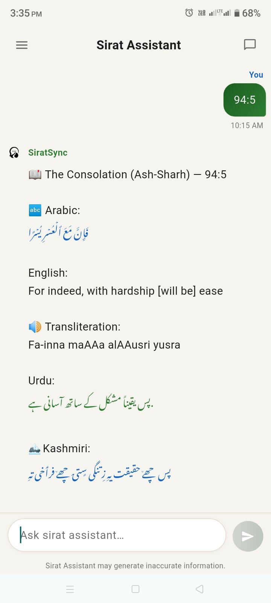
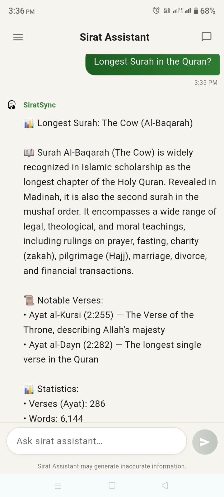
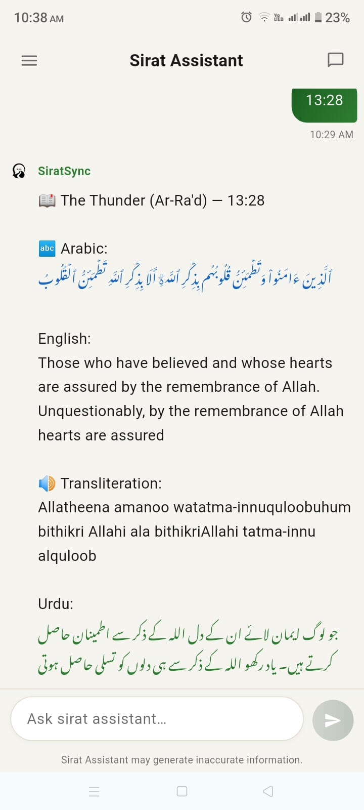
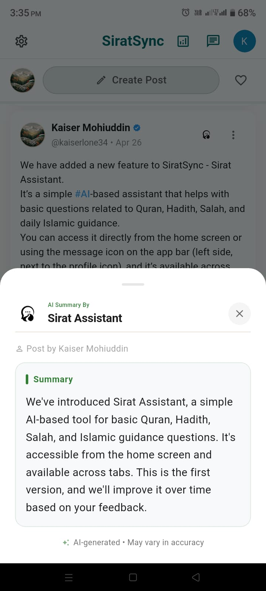
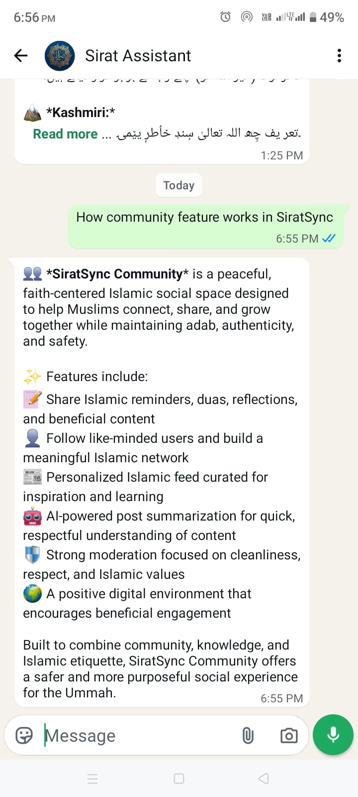
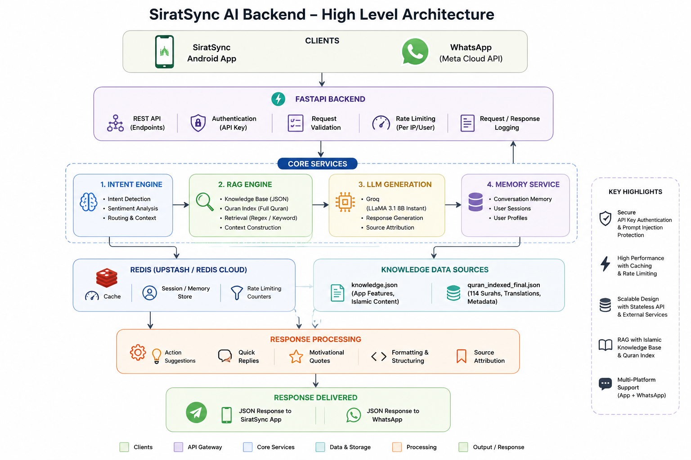

<div align="center">

# 🕌 SiratSync AI Backend

**The conversational AI engine powering Sirat Assistant — an Islamic lifestyle companion helping Muslims stay consistent in Salah, Quran, Dhikr, and daily habits.**

[](https://www.python.org/)
[](https://fastapi.tiangolo.com/)
[](https://redis.io/)
[](https://groq.com/)
[](#license)
[](https://github.com/Lonekaiser04/SiratSync-ai-agent/commits/main)
[](https://github.com/Lonekaiser04/SiratSync-ai-agent/stargazers)

**🌐 [Website](https://siratsync.in) · 📱 [Get it on Google Play](https://play.google.com/store/apps/details?id=com.islamic.streakly) · 💬 [Chat on WhatsApp](https://wa.me/919541871382)**

</div>

---

## 📖 Table of Contents

> The links below use GitHub's standard heading-anchor format; if any don't jump correctly after pushing (emoji-prefixed anchors occasionally render inconsistently), the section is still easy to find by scrolling — headings are unchanged below.

- [What is SiratSync AI?](#what-is-siratsync-ai)
- [Why This Project?](#why-this-project)
- [Screenshots](#screenshots)
- [Project Highlights](#project-highlights)
- [Features](#features)
- [Architecture Overview](#architecture-overview)
- [Performance & Optimizations](#performance--optimizations)
- [Tech Stack](#tech-stack)
- [Project Structure](#project-structure)
- [Quick Start](#quick-start)
- [Authentication](#authentication)
- [API Reference](#api-reference)
- [Deployment (Render)](#deployment-rendercom)
- [Roadmap](#roadmap)
- [Contributing](#contributing)
- [License](#license)

---

## 🧭 What is SiratSync AI?

**SiratSync AI Backend** is the FastAPI service behind **Sirat Assistant** — a conversational AI that answers Islamic questions, looks up Quranic verses across four languages, explains app features, and gently supports users in building consistent worship habits (Salah, Quran, Dhikr, fasting).

**The problem it solves:** most "Islamic chatbots" are either a thin wrapper around a general-purpose LLM (prone to fabricating verses or citations) or a static FAQ bot with no conversational depth. SiratSync AI sits in between — it grounds responses in a real, structured Quran dataset and a curated knowledge base wherever possible, and only falls through to the LLM for open-ended conversation, with an explicit system prompt boundary against giving fatwas, medical/legal advice, or claims of unseen knowledge.

**What makes it different, concretely:**
- Direct verse/surah lookups are answered from **structured data, not generation** — no LLM call, no hallucination risk, sub-second response.
- Conversational context (e.g. "show me verse 5 of that") is tracked **per user**, not globally — a subtle but important correctness property under concurrent load.
- It's a **multi-channel** backend: the same intent/RAG/LLM pipeline serves the in-app chat, the Community post-summarizer, and a live WhatsApp bot through one codebase.

---

## 💡 Why This Project?

This backend was built with a specific engineering philosophy: **prefer retrieval over generation wherever ground-truth data exists.** For a domain like Islamic content, an LLM confidently generating an incorrect verse or misattributed hadith isn't just a bug — it's a trust and accuracy problem. So the architecture is deliberately layered:

1. Can this be answered from **structured data** (a specific verse, a known app feature)? → Answer directly, no LLM.
2. Can this be answered by **retrieving** relevant Quran/knowledge-base content? → Ground the LLM in that retrieved context.
3. Otherwise → let the LLM converse naturally, but within an explicit system-prompt boundary (no fatwas, no medical/legal advice, no claims of unseen knowledge, defer to scholars on serious matters).

This also drives a practical benefit: a large share of real traffic (greetings, feature questions, direct verse lookups) never touches the LLM at all — which is both faster and cheaper than routing everything through generation.

> **Honesty note (hadith content):** the app's prompts and UI reference Sahih al-Bukhari and Sahih Muslim, but **no hadith corpus is currently bundled in this repository** — only a handful of informally-attributed motivational quotes (no hadith number or chain). This is called out explicitly rather than hidden; see [Roadmap](#-roadmap).

---

## 📸 Screenshots

This backend powers Sirat Assistant across the SiratSync app and WhatsApp.

<table>
  <tr>
    <td width="33%">
      
      <p align="center"><em>In-app guidance, grounded in app features</em></p>
    </td>
    <td width="33%">
      
      <p align="center"><em>Direct verse lookup (94:5) — Arabic, English, transliteration & Urdu</em></p>
    </td>
    <td width="33%">
      
      <p align="center"><em>Surah-level queries with stats & notable verses</em></p>
    </td>
  </tr>
  <tr>
    <td width="33%">
      
      <p align="center"><em>Explaining app features conversationally (via WhatsApp)</em></p>
    </td>
    <td width="33%">
      
      <p align="center"><em>AI post summarization in the Community feed</em></p>
    </td>
    <td width="33%">
      
      <p align="center"><em>WhatsApp: verse lookup with similar-ayah suggestions</em></p>
    </td>
  </tr>
</table>

---

## ⭐ Project Highlights

A quick summary of the engineering decisions this repo is most worth reviewing for:

| Area | What's notable |
|---|---|
| **Per-user context isolation** | Conversational follow-ups ("verse 5 of that") are scoped per `user_id`, with thread-safe locking — prevents cross-user context leakage under concurrent load. |
| **Async LLM calls** | Uses `AsyncGroq` throughout so LLM calls don't block the FastAPI event loop under concurrent traffic. |
| **Redis-backed rate limiting & caching** | Sliding-window rate limiting and response caching are Redis-backed when available, so limits and cache state stay correct across multiple workers/instances — not just single-process. |
| **Graceful degradation** | Every Redis-dependent component (memory, cache, rate limiting) has an in-process fallback if Redis is unavailable, so local dev needs zero external services. |
| **Real health checks** | `/health` performs an actual (short, cached) request to Groq — not just a truthy check on the client object — so it can genuinely detect an LLM outage. |
| **Defense-in-depth on auth & input** | Internal endpoints require an API key (constant-time comparison), and user input is sanitized against common prompt-injection patterns before reaching the LLM. |
| **Multi-channel from one pipeline** | The same intent detection → RAG → LLM pipeline serves in-app chat, community post summarization, and a live WhatsApp Cloud API integration. |

---

## ✨ Features

- 🕌 **Prayer guidance** — prayer-time queries, Adhan notification help, missed-prayer support
- 📖 **Quran lookup** — full 114-surah index with English, Urdu, and Kashmiri (with Tafsir) translations, transliteration, and similar-ayah suggestions
- 📚 **Hadith references** — Sahih al-Bukhari & Sahih Muslim referenced in prompts/UI *(see [honesty note](#-why-this-project) — no bundled corpus yet)*
- 📿 **Duas, Adhkar & Tasbih** — situational duas, morning/evening adhkar, digital counter support
- ⭐ **Habit tracking support** — consistency-aware responses based on a lightweight Redis-derived user profile
- 🧭 **Qibla & Calendar** — directional and Hijri calendar query support
- 🌙 **Ramadan Mode** — Suhoor/Iftar timing and fasting-related guidance
- 👥 **Community AI tools** — AI-powered post summarization that preserves sacred text verbatim
- 💬 **WhatsApp integration** — the full assistant, available via Meta's WhatsApp Cloud API
- 🎯 **Learn Salah & Shahadat guide** — step-by-step guidance for new/practicing Muslims

---

## 🏗️ Architecture Diagram

  
      <p align="center"><em>High Level Architectural Diagram</em></p>


### Component Breakdown

| Component | Responsibility |
|---|---|
| **Client** | The in-app chat UI, the WhatsApp webhook consumer, or any HTTP client — all speak the same JSON contract. |
| **FastAPI Backend** | Async request handling, Pydantic v2 validation on every input, correlation-ID logging, CORS. |
| **Rate Limiting** | Redis sorted-set sliding window (60 req/min default); falls back to a bounded in-process limiter if Redis is unavailable. |
| **Response Cache** | Redis-backed (or local TTL fallback) cache for non-personalized queries — skips the LLM entirely on a cache hit. |
| **Intent Detection** | Rule-based classifier producing a primary intent, sub-intent, sentiment, and urgency score — no LLM call needed. |
| **RAG Pipeline** | Retrieves from the full Quran index (114 surahs, 4 languages) and a curated knowledge base; resolves direct verse/surah references without generation. |
| **LLM** | Groq's `llama-3.1-8b-instant`, called asynchronously, only invoked when retrieval alone can't answer the query. |
| **Response Processing** | Builds action suggestions, source attributions, and motivational content around the reply. |
| **Redis Memory** | Stores the last 50 messages and a lightweight consistency profile per user, written via a single pipelined round trip. |

---

## ⚙️ Performance & Optimizations

The following optimizations are implemented in the current codebase (no benchmark numbers are published yet — see note below):

- ✅ **Async end-to-end** — FastAPI routes and the Groq client (`AsyncGroq`) are both async, so LLM calls don't block the event loop under concurrent requests.
- ✅ **Retrieval-first routing** — direct verse/surah lookups and known app-feature questions are answered from structured data or quick-reply templates, skipping the LLM call entirely for a meaningful share of traffic.
- ✅ **Redis-backed response cache** — repeated, non-personalized queries are served from cache (personalization is detected and excluded from caching automatically).
- ✅ **Redis sliding-window rate limiting** — correct under multiple workers/instances, unlike a naive in-process counter.
- ✅ **Pipelined Redis writes** — each chat turn's memory + stats update is a single pipelined round trip, not several sequential calls.
- ✅ **Startup preloading** — the Quran index is loaded once at application startup, not lazily on a user's first request.
- ✅ **Stateless request handling** — all per-request state lives in Redis (or an in-process fallback), so the API layer itself holds no session state and can scale horizontally behind a load balancer once Redis is shared.
- ✅ **Strict request validation** — Pydantic v2 models reject empty/oversized input before any processing begins.

> **On benchmarks:** this README intentionally does not include latency or throughput numbers, because none have been formally measured and published yet. If/when load testing is done, results will be added here as a table rather than prose claims.

---

## 🧱 Tech Stack

| Layer | Technology |
|---|---|
| API Framework | [FastAPI](https://fastapi.tiangolo.com/) (async) |
| LLM Provider | [Groq](https://groq.com/) — `llama-3.1-8b-instant`, via the async SDK |
| Data Validation | [Pydantic v2](https://docs.pydantic.dev/) |
| Memory / Cache / Rate Limiting | [Redis](https://redis.io/) (Upstash-compatible), with in-process fallback |
| Messaging Channel | WhatsApp Cloud API (Meta), HMAC-verified webhook |
| Language | Python 3.11 |

<details>
<summary><strong>Why no vector database / LangChain?</strong> (click to expand)</summary>

<br>

Retrieval in this project is currently **regex and keyword-based** against a hand-curated knowledge base and the full Quran index — not embedding/vector search, and not built on LangChain. This is a deliberate current tradeoff: it works precisely for known topics and exact verse/surah references, but won't generalize to phrasings outside the curated topic list. Adding a semantic search layer (e.g. sentence-transformers over the existing verse/knowledge-base text) is the highest-leverage planned improvement — see [Roadmap](#-roadmap).

</details>

---

## 📂 Project Structure

```text
chatbotbackend/
├── app/
│   ├── api/
│   │   ├── chat.py              # POST /chat — main chat endpoint
│   │   ├── health.py            # GET /health — real Groq connectivity check
│   │   ├── summarize.py         # POST /summarize — post summarization
│   │   ├── user.py              # GET/DELETE /user/{id} — auth-protected
│   │   └── whatsapp.py          # WhatsApp Cloud API webhook
│   ├── core/
│   │   ├── config.py            # Centralized, validated env config
│   │   └── security.py          # API-key auth + prompt-injection guards
│   ├── data/
│   │   ├── knowledge.json               # Islamic content / app-feature KB
│   │   └── quran_indexed_final.json     # Full Quran, 114 surahs, 4 languages
│   ├── middleware/
│   │   ├── rate_limit.py        # Redis sliding-window rate limiting
│   │   └── request_logger.py    # Correlation-ID request logging
│   ├── models/                  # Pydantic v2 request/response models
│   ├── prompts/                 # LLM system + summarization prompts
│   ├── services/
│   │   ├── action_service.py    # Action suggestions & motivational quotes
│   │   ├── intent_service.py    # Rule-based intent & sentiment detection
│   │   ├── memory_service.py    # Redis-backed session & user profiling
│   │   └── rag_service.py       # Knowledge base + Quran retrieval
│   ├── utils/
│   │   ├── cache.py             # Redis-backed response cache (local fallback)
│   │   └── helpers.py           # Quick replies, RAG-grounded LLM calls
│   └── main.py                  # FastAPI entry point (Quran preloaded at startup)
├── screenshots/                 # README screenshots
├── scripts/
│   ├── cleanup_memory.py        # Purge inactive Redis sessions (scheduled)
│   ├── generate_metadata.py     # Offline Quran metadata preprocessing
│   └── keep_alive.py            # Render.com spin-down prevention
├── tests/                       # Test suite
├── .env.example                 # Local environment template
├── .render-build.sh             # Render.com build script
├── requirements.txt
├── runtime.txt                  # Pinned Python version (Render build)
├── LICENSE
└── readme.md
```

---

## 🚀 Quick Start

### Prerequisites

- Python 3.11+
- A [Groq API key](https://console.groq.com/)
- (Optional, recommended for production) A Redis instance — [Upstash](https://upstash.com/) works well

### 1. Clone & install

```bash
git clone https://github.com/Lonekaiser04/SiratSync-ai-agent.git
cd SiratSync-ai-agent

python3 -m venv venv
source venv/bin/activate      # Windows: venv\Scripts\activate

pip install -r requirements.txt
```

### 2. Configure environment

```bash
cp .env.example .env
```

Fill in at minimum:

```env
GROQ_API_KEY=your_groq_api_key_here
INTERNAL_API_KEY=              # generate your own — see Authentication below

REDIS_URL=rediss://default:<password>@<host>:6379
# or individual Upstash vars — see .env.example for the full list
```

### 3. Run

```bash
uvicorn app.main:app --host 0.0.0.0 --port 8000 --reload
```

### 4. Verify

Open **`http://127.0.0.1:8000/docs`** for the interactive API explorer, or check:

```bash
curl http://127.0.0.1:8000/health
```

> A healthy response looks like `{"status": "healthy", "components": {"llm": "connected", ...}}`. If `llm` shows `"error"`, double-check `GROQ_API_KEY`.

---

## 🔐 Authentication

The `/user/{user_id}/summary` and `/user/{user_id}/session` endpoints expose per-user data and require an `X-API-Key` header matching `INTERNAL_API_KEY`.

```bash
# Generate your own key — this isn't issued by any external service
python -c "import secrets; print(secrets.token_urlsafe(32))"
```

```bash
curl -H "X-API-Key: your_generated_key" \
     http://127.0.0.1:8000/user/some_user/summary
```

> If `INTERNAL_API_KEY` is left unset, a random key is generated per-process at startup — fine for a quick local test, but it changes on every restart. Set it explicitly for anything persistent, and **always** in production.

---

## 📡 API Reference

| Method | Endpoint | Auth | Description |
|---|---|:---:|---|
| `POST` | `/chat` | — | Main conversational endpoint |
| `POST` | `/summarize` | — | Summarize a community post |
| `GET` / `HEAD` | `/health` | — | Health check (real Groq connectivity test) |
| `GET` | `/user/{user_id}/summary` | 🔑 | User session profile & consistency stats |
| `DELETE` | `/user/{user_id}/session` | 🔑 | Clear a user's session from Redis |
| `GET` / `POST` | `/webhook/whatsapp` | 🔒 HMAC | WhatsApp Cloud API webhook |

<details>
<summary><strong>POST /chat</strong> — request & response schema</summary>

<br>

**Request**
```json
{
  "user_id": "user123",
  "message": "How do I track my prayers?",
  "user_name": "Ahmad",
  "app_version": "2.0",
  "context": "(optional) prior conversation string",
  "user_timezone": "Asia/Karachi"
}
```

| Field | Constraint |
|---|---|
| `message` | required, 1–2000 chars |
| `user_id` | required, max 128 chars |
| `context` | optional, truncated at 4000 chars |
| `user_timezone` | optional, must be a valid IANA name (e.g. `Asia/Karachi`); drives morning/evening suggestion timing — defaults to UTC if omitted |

**Response**
```json
{
  "reply": "...",
  "intent": "salah",
  "sub_intent": "learn_more",
  "sentiment": "neutral",
  "actions": {
    "reminders": [],
    "habits": [],
    "duas": [],
    "resources": [],
    "encouragement": "",
    "quick_actions": []
  },
  "suggestions": ["🕌 Prayer Times", "⭐ Habits", "📖 Quran", "📿 Dhikr"],
  "motivational_quote": "...",
  "timestamp": "2026-01-01T12:00:00.000000",
  "sources": [
    { "type": "quran", "label": "Sahih International", "detail": "English Translation" }
  ]
}
```

</details>

<details>
<summary><strong>POST /summarize</strong> — request & response schema</summary>

<br>

**Request**
```json
{ "user_id": "user123", "post_content": "Long community post text here..." }
```

**Response**
```json
{ "summary": "Condensed version of the post.", "original_length": 480, "summary_length": 95 }
```

</details>

<details>
<summary><strong>GET /health</strong> — response schema</summary>

<br>

```json
{
  "status": "healthy",
  "version": "2.0",
  "timestamp": "...",
  "components": {
    "intent_detector": "loaded",
    "rag_knowledge": "loaded (32 categories)",
    "memory_manager": {
      "status": "active",
      "backend": "redis",
      "sessions": { "redis_sessions": 24, "fallback_sessions": 0 }
    },
    "llm": "connected"
  },
  "uptime": "online"
}
```

`llm` reflects a real (short, ~60s-cached) request to Groq — `"error"` means Groq is genuinely unreachable or the API key is invalid, not just that the client object exists.

</details>

---

## ☁️ Deployment (Render.com)

Set the following environment variables in your Render dashboard (never commit `.env`):

| Variable | Required | Notes |
|---|:---:|---|
| `GROQ_API_KEY` | ✅ | |
| `INTERNAL_API_KEY` | ✅ | Set explicitly — an auto-generated key changes on every restart |
| `REDIS_URL` (or Upstash vars) | Recommended | Without it, caching/rate-limiting/memory fall back to single-process in-memory state |
| `ALLOWED_ORIGINS` | ✅ | Your real frontend domain(s) |
| `ENV` | ✅ | `production` |
| `RENDER_URL` | Optional | Your service's own `/health` URL, used by the keep-alive pinger |
| `RENDER` or `KEEP_ALIVE` | Optional | `true` to enable the keep-alive pinger |

> **First deploy:** set env vars first, deploy once manually to confirm `/health` looks correct, then enable auto-deploy. Render keeps full deploy history under the service's **Events** tab — one-click rollback to any previous deploy if something's wrong.

---

## 🗺️ Roadmap

> Suggestions below reflect known gaps identified during development — not commitments or dates.

- [ ] **Semantic / hybrid search** — add an embedding-based retrieval layer on top of the existing keyword/regex matching for better generalization
- [ ] **Verified hadith corpus** — source a numbered, chain-verified hadith dataset to back the app's existing Sahih al-Bukhari / Sahih Muslim references
- [ ] **Formal load testing** — publish real latency/throughput numbers once benchmarked
- [ ] **Automated CI** — lint/test pipeline on push
- [ ] **Expanded test coverage** — grow the `tests/` suite alongside new features

---

## 🤝 Contributing

This repository is primarily maintained as a personal project, but issues, suggestions, and pull requests are welcome.

1. Fork the repo
2. Create a feature branch (`git checkout -b feature/your-feature`)
3. Commit your changes with a clear message
4. Open a pull request describing the change and why it's needed

Please avoid introducing fabricated religious content, unverified citations, or breaking the existing per-user context isolation and auth guarantees — these are treated as correctness properties of the project, not just style preferences.

---

## 📄 License

This project is licensed under the **MIT License**.

```
MIT License

Copyright (c) 2026 Kaiser Mohiuddin / SiratSync

Permission is hereby granted, free of charge, to any person obtaining a copy
of this software and associated documentation files (the "Software"), to deal
in the Software without restriction, including without limitation the rights
to use, copy, modify, merge, publish, distribute, sublicense, and/or sell
copies of the Software, and to permit persons to whom the Software is
furnished to do so, subject to the following conditions:

The above copyright notice and this permission notice shall be included in all
copies or substantial portions of the Software.

THE SOFTWARE IS PROVIDED "AS IS", WITHOUT WARRANTY OF ANY KIND, EXPRESS OR
IMPLIED, INCLUDING BUT NOT LIMITED TO THE WARRANTIES OF MERCHANTABILITY,
FITNESS FOR A PARTICULAR PURPOSE AND NONINFRINGEMENT. IN NO EVENT SHALL THE
AUTHORS OR COPYRIGHT HOLDERS BE LIABLE FOR ANY CLAIM, DAMAGES OR OTHER
LIABILITY, WHETHER IN AN ACTION OF CONTRACT, TORT OR OTHERWISE, ARISING FROM,
OUT OF OR IN CONNECTION WITH THE SOFTWARE OR THE USE OR OTHER DEALINGS IN THE
SOFTWARE.
```

---

## 👤 Developer

Built by **Kaiser Mohiuddin** — CS student & founder of SiratSync.

**🌐 [Website](https://siratsync.in) · 📱 [Android App](https://play.google.com/store/apps/details?id=com.islamic.streakly) · 💬 [WhatsApp](https://wa.me/919541871382)**

For professional inquiries, connect via LinkedIn or the official website.

<div align="center">

*Built to help the Ummah stay consistent, one habit at a time.* 🤲

</div>